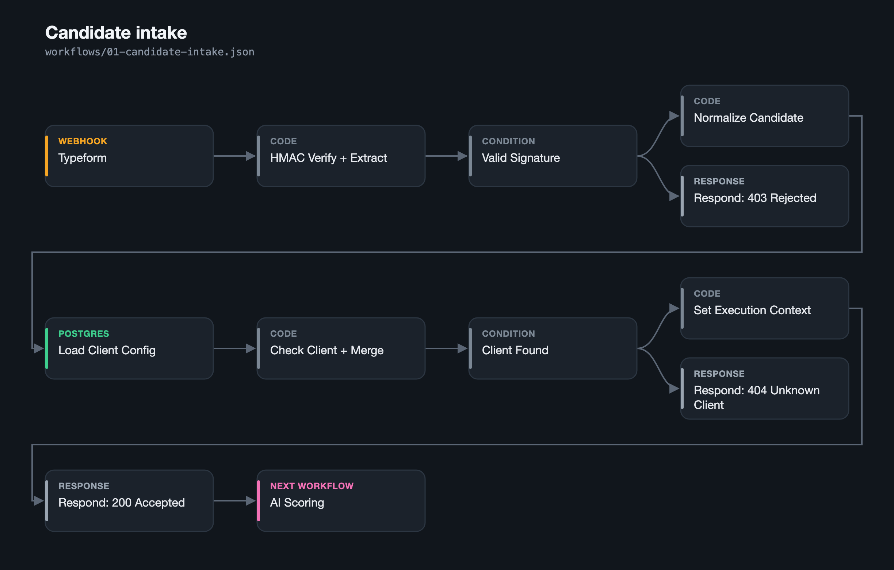
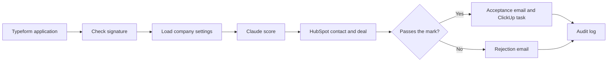
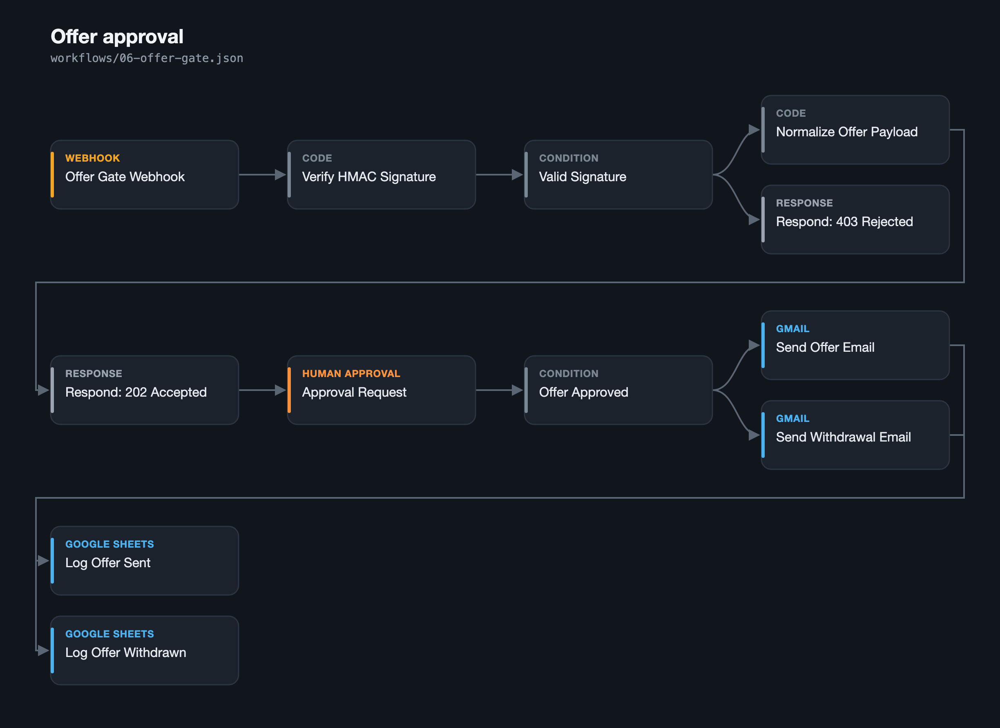

# Recruitment Pipeline

Scores every job application with Claude, updates HubSpot, alerts your team in Slack and emails the candidate. Offer emails never go out until a person approves them in Slack.

**Built for** recruiting agencies and HR teams that already use HubSpot, Slack, Gmail and ClickUp and want every applicant handled the same way.

**What is in this repo:** seven n8n workflows, a setup guide and a placeholder map. Import them into your own n8n and connect your accounts.

## What happens when someone applies

1. Typeform sends the application. The intake workflow checks the Typeform signature with a constant time comparison and rejects anything that does not match.
2. It loads the hiring company's settings from Postgres, including its pass mark (60 out of 100 unless you change it).
3. Claude Haiku scores the application on role fit (40%), experience (35%) and writing quality (25%). The cover note is wrapped in markers and treated as plain text, so instructions hidden inside it are ignored.
4. HubSpot gets a new or updated contact, matched by email, and a deal with the scores.
5. Slack gets an alert. The candidate gets an acceptance or a rejection email. Qualified candidates also get a ClickUp follow up task for the recruiter.
6. One row with 18 fields is added to a Google Sheets audit log.

## Offers need a person

Offers run in their own workflow. It checks the request signature, rejects requests older than five minutes, posts the offer details to Slack and waits. **Approve** sends the offer email. **Reject** sends a withdrawal email. Both outcomes are logged.

## Workflows

| File | Starts when | What it does |
| --- | --- | --- |
| `00-error-handler.json` | Any workflow fails | Posts the failed step, error and candidate name to Slack |
| `01-candidate-intake.json` | Typeform submits | Checks the signature, cleans the fields, loads company settings |
| `02-ai-scoring.json` | Called by 01 | Builds the prompt, calls Claude, calculates the weighted score |
| `03-crm-routing.json` | Called by 02 | Creates or updates the HubSpot contact and creates the deal |
| `04-comms-routing.json` | Called by 03 | Sends the Slack alert, the email and the ClickUp task |
| `05-audit-log.json` | Called by 04 | Adds the audit row to Google Sheets |
| `06-offer-gate.json` | A recruiter sends an offer | Waits for Slack approval, then sends or withdraws the offer |

## Security

* Both webhooks require a valid HMAC SHA256 signature, compared in constant time.
* Successful runs do not keep execution data, so candidate details do not sit in n8n history.
* Every sub workflow accepts calls only from workflows owned by the same n8n account.
* Candidate text has n8n expression syntax stripped before it is used anywhere.
* Google Sheets writes use raw mode, so candidate text cannot turn into a formula.
* API keys live in the n8n credential store. The JSON files contain placeholders only.

## Set up

Follow [SETUP.md](SETUP.md) for the database tables, credentials, import order and activation order. [replacements.txt](replacements.txt) lists every placeholder and where to find its value.

## Good to know

* The pass mark, scoring prompt and email templates are stored per company in Postgres, so one n8n instance can serve several hiring companies.
* A repeat application updates the existing HubSpot contact instead of creating a duplicate. The pipeline itself does not block repeat submissions.

Built by Rex Owen Quintenta · [Email](mailto:owenquintenta@gmail.com) · [LinkedIn](https://linkedin.com/in/owendev) · [Upwork](https://www.upwork.com/freelancers/~016d94e91b51fc9dec)
